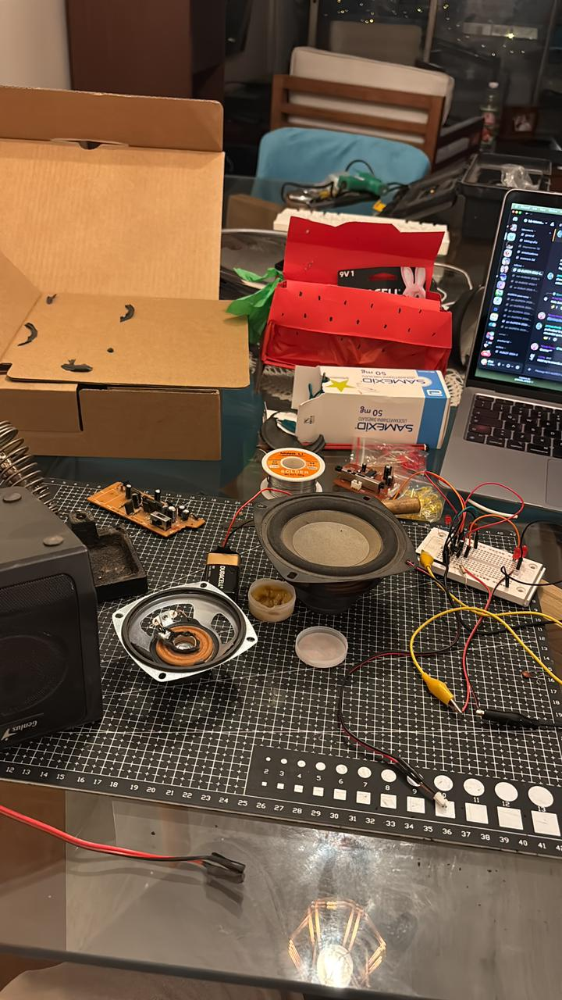



# bitacora-taller-III
[Bitacora.md](https://github.com/user-attachments/files/26443904/Bitacora.md)
En la miniserie sobre la Bauhaus, lo que más me impactó fue el choque radical entre dos formas de entender el mundo… la de Walter Gropius y la de Johannes Itten.

Por un lado, tenemos a Gropius: un hombre serio,  estratega que busca que todo sea funcional, eficiente y perfecto para la industria. Y por el otro lado aparece Itten: un tipo super "hippie", casi como un monje, que obligaba a los alumnos a detenerse, a respirar y a estar presentes. Él no quería que empezaran a dibujar de inmediato, el quería que se conectaran con su interior primero.

En mi opinión, hoy en día la figura de **Itten es mucho más necesaria que la de Gropius**.

Vivimos en una época llena de automatización donde parece que estamos perdiendo la identidad. El diseño se está volviendo algo puramente automatico, como si solo estuviéramos dejando que las máquinas reemplacen nuestra eficiencia. Si nos descuidamos, nos convertimos en operadores de herramientas y no más en creadores…

Itten decía que antes de diseñar era necesario **"limpiar el espíritu"**. Para mí, esto es clave. En un mundo donde normalmente yo vivo divagando en sobrepensamiento. Esa pausa es lo que nos permite conectar con nuestra pasión. Itten nos recuerda que el diseño tiene una parte espiritual y que el caos creativo en realidad es lo que nos hace humanos. La verdadera identidad no sale de un tutorial sino de nuestras propias vivencias, de nuestros errores y de nuestra visión única del mundo.

### **Bitácora de Proceso: Taller de Interacción Digital**

**Jueves 12 de Marzo** Empezamos el proyecto haciendo un mapa mental individual. Como no sabía muy bien de qué hablar, terminé contando sobre mis gustos, mi introduccion al tatuaje y explicando un poco cómo funciona mi cabeza al momento de pensar. Al final, resultó que mientras presentábamos, las profes estaban anotando nuestras cualidades para armar los grupos de trabajo más adelante. De encargo nos dejaron ver la serie "Bauhaus: una nueva era" y redactar un ensayo sobre algún tema de ahí que nos llamara la atención.

**Lunes 16 de Marzo** La primera mitad de la clase la usamos para comentar la serie de la Bauhaus. Después pasamos a teoría sobre el Estudio de Usuarios (UX). Vimos métodos de observación y tipos de entrevistas, y nos explicaron los mapas de empatía, que sirven harto para ordenar visualmente la información de las personas. En la segunda parte, donde yo llegue un poco tarde, me logré incorporar al grupo de Andres y Camila, donde me entrevistaron y yo logré llegar a mi juguete de cuando era pequeño que consistía en un mono donde mi mamá dejaba cartas y yo a ella para comunicarnos en la jornada donde no nos veiamos. Al final de la clase nos presentaron el "drawdio", para ir cachando cómo se venía la mano con la electrónica del proyecto.

**Jueves 19 de Marzo** Se suponía que traíamos materiales para armar un segundo prototipo, pero al final la clase tomó otro rumbo y nos dedicamos a bocetar mejoras del juguete.  Oficialmente logré unirme al grupo.  Quedamos de encargo conseguir los componentes electrónicos para armar el drawdio en una protoboard para la próxima sesión.

**Lunes 23 de Marzo** Día un poco caótico. Como curso no logramos coordinarnos el fin de semana para comprar los componentes, así que la clase partió atrasada. Andres llegó con materiales y yo partí a San diego a comprar lo demás. Logramos hacer una clase introductoria al drawdio.

hí.**Jueves 26 de Marzo** *(Falté)*

**Lunes 30 / Martes 31 de Marzo** Días de aterrizar todo y estructurar el proyecto bajo la lógica del "Qué, Para Qué y Cómo". Juntamos la maqueta de la frutilla con lo que aprendimos de los circuitos, y definimos la bajada final de Fruto Fugaz:

* **Qué es (Brief):** Un juguete de interacción lumínica que funciona como un buzón análogo para dejar notas.  
* **Para qué es (Fundamentación):** Para generar una pausa y un contenedor de emociones frente a las ausencias físicas del día a día.  
* **Cómo funciona (Implementación):** El mensaje de papel actúa como aislante en un circuito IC555. Al sacar la carta, las placas se tocan y encienden el LED.

**Jueves 2 de abril**
Montaje y entrega, organizarse mejor para la otra entrega con las bitacoras

**Lunes 6 de abril**
A veces nos venden esta idea romántica de que el diseño y la innovación son procesos limpios que ocurren en un vacío, pero El código de la discordia” nos aterriza de golpe en una realidad mucho más real, es bastante frustrante para los que estamos entrando en un mundo creativo. Si lo miramos desde nuestra visión como diseñadores, la serie no es solo un drama legal sobre quién programó esto, sino es la historia de cómo una visión artística y técnica increíblemente potente termina siendo vencida por el ego y la plata de una corp que ni siquiera entiende el alma de lo que está robando.
Vemos a este grupo en Berlín por los años 90, en un caos creativo post-muro que se siente súper real… Esa necesidad de experimentar, de romper las reglas y de creer que el diseño y la tecnología pueden cambiar cómo vemos el mundo. Ellos crearon Teravision no para hacerse millonarios, sino porque tenían una idea visual que parecía imposible: navegar por el planeta de forma fluida. Para mi como estudiante, uno conecta con esa pasión de pasar noches desvelado tratando de que algo funcione, pero el concepto central de la serie, y lo que más me pega, es la fragilidad de la autoría. Es ver cómo una multinacional como Google llega, toma esa base, le pone un logo bonito y borra de la historia a los que realmente pusieron su esencia ahí. La serie nos plantea una "discordia" que es ética. ¿de quién es la idea si el que la ejecuta a gran escala es otro? Es un choque de realidad tremendo que nos recuerda que, en el mercado actual, la genialidad creativa muchas veces queda sepultada bajo capas de abogados y tecnicismos. Al final, te quedas con un sabor amargo, porque aunque sabemos que ellos tenían la razón, el sistema está hecho para que el pez grande se coma al chico y luego te convenza de que el chico nunca existió. Es un recordatorio de que tenemos que defender nuestra identidad creativa y creer más en nosotros como creativos.

**Jueves 9 de abril**
 Primera visita al museo recién el 24 de abril estará habilitado, las obras varían entre abstracción, pintura y videos
 Según la guardia, hay 3 guardias… el flujo de gente varía entre fechas pero lo que más vienen son extranjeros y estudiantes, el entorno del parque si está vivo pero no es mucha la gente que viene a observar el museo en la semana
Desde mi percepción logró que hay muchos espacios en blanco pero me gusta el contraste de lo moderno y la arquitectura neoclásica, siento que al medio podría haber una obra super loca

**Lunes 13 de abril**

Bajamos las ideas, entendiendo más el arduino igual, sinceramente es primera vez que logro adentrarme más en esto y me parece pro.
Contraste iluminado y amplio. Llegamos a esos conceptos, lograr bajarlos es la pega ahora, estamos probando con luces y la profe ahi tambien dando sus ideas. 
Aun aterrizando lo que hay que llegar, no veo mucha problemática en el museo

**Jueves 16 de Abril**

El output recibimiento de información, ya sea una pantalla, luz o sonido

D/I       A/I      P     D/O    A/O

Movimiento maker: consistía en 
Arduino es una placa basada en el chip ATmega168 
Tiene 13 pins dig. 6 de los cuales permiten output o salidas PWM (pule width modulation) ? / en una linea de tiempo yo tengo 0 , 1 , 2 , 3 , etc.. 1 o 0 , cuando llega un pulso electrico , va a estar arriba y cuando no , abajo, pueden ser digitales o no, es como una cola de chancho 
Que sean analogos significa que puede ser mas manual, como un sensor de movimiento. (me va a dar matices grises no como los digitales) 

Y 6 inputs o entradas analogas
Arduino es una placa como un computador que yo le instalo un tipo de software 

Def es una plataforma de recurso abierto (open source) basada en un software y hardware de uso amistoso para artistas, diseñadores
software, arduino basado en wiring y processing

Conceptos principales : CONTRASTE -  LUMINADO - AMPLIO

**Clase lunes 20**	
Prototipo protoboard luces con un sensor de movimiento, no hemos bajado el brief pero si siguen en pie los conceptos utilizados anteriormente, se logró el prototipo y necesitamos hacerlo pero en 4 veces, investigar al usuario y nombres tambien. 

El diseñador en el que nos inspiramos se llama Olafur Eliasson 
CONTRASTE -  LUMINADO - AMPLIO

Preguntar tambien si es necesario otro protoboard o utilizar micas de vidrio para poder intensificar los colores 
Tambien mostrar obras quizas dependiendo de los colores, pero creo que esta un poco complicado proponer ampolletas de rayos UV

La ruta de los aztecas santiago 
Fomentar la union de luces con la naturaleza, movimientos 
Coincidente y poder , grupo 
serendipia , hallazgo valioso que se produce de forma distintinta o casual. 

Falta aterrizar mucho igual, saber como van a funcionar las luces y la estructura, conversar mas en grupo. 
Pulse room. Rafael Lozano 

Mecanismo de cuatro personas 
Usamos la interfaz física de Lozano para generar la inmersión perceptiva de Eliasson
Puede ser que sea usado por stencil en plantillas 

**Jueves 23 De abril**
Revisando como las 4 placas pueden funcionar y tratar de ir prendiendo las luces. 
Tambien revisar el rol de los actores para poner en la lamina impresa, entender que el actor mas distante puede ser la direccion del museo y el ministerio esta mas cerca de este. 

**Lunes 27 De Mayo** 
Revisando perfil de usuario, especificando mas aun de lo que llevamos, entendiendo la logica de cada uno de estos usuarios, emociones mas especificas y requerimientos mas especificos.
Es importante entender al usuario de manera que tambien el mensaje logre llegar a su cometido.
Journey map — Viaje del usuario que refleja las acciones o interacciones (antes durante y dps)
 sino que el color azul es una frecuencia grave, y el rojo ES una frecuencia aguda. Al pisar
 concepto abstracto y lo bajaste a una metáfora visual potente.
 utiliza la sinestesia para traducir la energía física del espectador en luz y sonido armónico, inspirándome en las auroras boreales donde el electromagnetismo se vuelve visible

Lograr colocar acordes de DO MAYOR
Aurora Philarmónica, buscar como explicar a los profes y mostrar esta instalacion, siento que las auroras puede, hay que buscar aterrizar el concepto y los sonidos, que es synestesia? La profe dijo algo super clave que es como el final y como una nueva dimension, el director de musica se llama Hans Zimmer, simula este nuevo comienzo y final a la vez, buscar algunos acordes que simulen las frecuencias alpha?
Buscar acordes y como bajar esto, tambien la instalacion tiene que estar limpia

